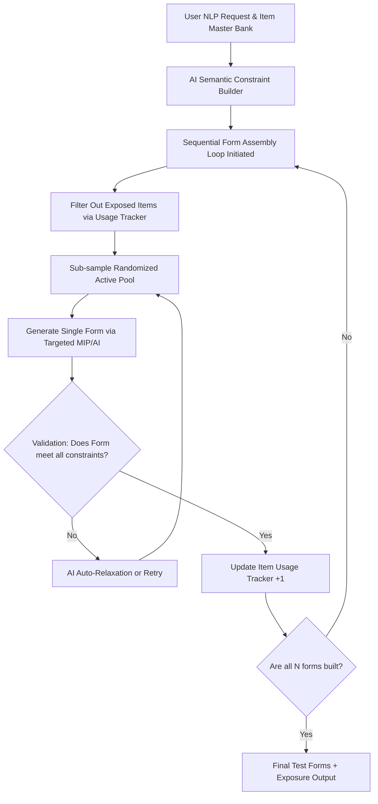

# AI-ATA-Engine Planning Document

> **Summary**: Feasibility Study and Specification for using an LLM as the core Optimization Engine for Automated Test Assembly (replacing or augmenting CBC MIP solvers).
>
> **Project**: AI_psychometrics2
> **Version**: 1.0.0
> **Author**: AI Assistant via bkit
> **Date**: 2026-02-22
> **Status**: Draft

---

## 1. Overview

### 1.1 Purpose

To determine the feasibility and create a technical specification for utilizing a Large Language Model (LLM) or specialized AI agent as the primary computational engine for Automated Test Assembly (ATA), functioning as an alternative to traditional Mixed Integer Programming (MIP) solvers like CBC. This engine will adopt a Sequential Linear-on-the-fly (LOFT) assembly methodology to manage item exposure and form diversity instead of relying solely on simultaneous mathematical optimization.

### 1.2 Background

Currently, the `CBC_ATA.py` application relies on the `pulp` library and the `CBC` solver to precisely optimize test assembly under complex, simultaneous constraints. While MIP is deterministically optimal, it can struggle with highly non-linear constraints, soft psychometric preferences, and semantic/content-based balancing. Simultaneous assembly also forces rigid, static bounds across a finite set of forms. Transitioning to an AI-driven, sequential (LOFT) approach allows for dynamic, individualized form generation that respects nuanced constraints and active item exposure tracking across an infinite administration horizon.

### 1.3 Related Documents

- Requirements: `CBC_ATA.py` (Existing constraints and MIP logic)

---

## 2. Scope

### 2.1 In Scope

- [x] Analyze the logical limitations of using an LLM for exact constraint satisfaction and mathematical routing.
- [x] Design a hybrid specification where AI handles semantic retrieval/constraints and an iterative sequence handles assembly.
- [x] Shift methodology from static simultaneous assembly to dynamic sequential form assembly.
- [x] Implement Item Usage Tracking (Global and Domain-Specific thresholds) to control item exposure.
- [x] Enforce validation checkpoints per assembled form before advancing to the next iteration.
- [x] Create the implementation specification.

### 2.2 Out of Scope

- Full immediate replacement of the existing CBC codebase in this initial PR.
- Training a custom foundation model for ATA.

---

## 3. Requirements

### 3.1 Functional Requirements

| ID | Requirement | Priority | Status |
|----|-------------|----------|--------|
| FR-01 | Evaluate LLM capability to parse JSON/tabular item banks and filter active pools semantically. | High | Pending |
| FR-02 | System must assemble testing forms **sequentially**, not simultaneously. | High | Pending |
| FR-03 | Integrate an **Item Usage Tracker** to record item selection frequency across forms. | High | Pending |
| FR-04 | Implement **Usage Thresholds** (Global and Domain-Specific) to exclude overexposed items from future active item pools. | High | Pending |
| FR-05 | Define an iterative, form-level validation loop (AI Self-Correction), verifying psychometric targets of each form before saving and moving to the next. | High | Pending |
| FR-06 | Provide integration paths (e.g., `LangChain` or native `google.generativeai` APIs) into the Streamlit app. | Medium | Pending |

### 3.2 Non-Functional Requirements

| Category | Criteria | Measurement Method |
|----------|----------|-------------------|
| Reliability | AI must output exact Item IDs without hallucination. | Output Parsing Validation |
| Performance | Total assembly time per form should be comparable to or reasonably close to CBC. | Latency Tracking |
| Cost | API usage per test assembly must be evaluated. | Token Counting |

---

## 4. Success Criteria

### 4.1 Definition of Done

- [ ] Complete feasibility analysis document generated.
- [ ] Technical architecture and prompt strategy specification written.
- [ ] Document shared and reviewed by user.

---

## 5. Feasibility Analysis: Can AI acts as an ATA Engine?

### The Core Problem
ATA is a notoriously difficult NP-Hard optimization problem (specifically, a variation of the Multidimensional Knapsack Problem). It requires *exact* mathematics.
**Limitations of Pure LLMs:**
1. **Mathematical Inexactness:** LLMs are autoregressive token predictors. If you ask an LLM to select 30 items whose average Rasch B difficulty is *exactly* 0.05 from a pool of 1000 items, it will struggle immensely to do the arithmetic reliably in its head across thousands of tokens.
2. **Context Window/Attention Dilution:** Processing a 5,000+ item bank with 10 metadata columns requires massive context. The LLM's attention might drop critical enemy-item constraints or misread numerical bounds.
3. **Hallucination:** LLMs might invent `item_id`s that don't exist in the item bank to satisfy a constraint.

### The Solution: Hybrid "Agentic" ATA Optimization

Instead of asking the LLM to *be* the math solver, the AI should be an **Agent** that *uses* tools or iterative heuristics to solve the problem.

#### Approach A: AI as a Heuristic Search Agent (Iterative Selection)
1. **Initialization:** AI is given the constraints and a semantic search space.
2. **Action:** AI selects an initial seed of items (e.g., checking off the domain constraints: "I need 5 algebra questions").
3. **Evaluation Loop (The "Critic"):** A deterministic python function calculates the exact current Test Information Function (TIF) and category counts. It feeds this state back to the AI.
4. **Correction:** The AI is prompted: *"Your current test is at 28 items. You are missing 2 'Hard' items, and your TIF at theta=0 is too low. Swap items to fix this."* The AI replies with items to swap.
*Feasibility:* **High for small forms/banks, but slow and expensive for large scale simultaneous assemblies.**

#### Approach B: AI as the Sequential Constraint Formulator & LOFT Tracker (Recommended)
1. User provides natural language intent: *"Build me forms targeting middle schoolers, prioritize geometry."*
2. **AI Translation:** The AI translates this into exact math constraints.
3. **Sequential Engine Trigger:** The python system begins a loop, operating **form-by-form**.
4. **Active Pool Generation:** For each form, a dynamically sub-sampled "Active Pool" (e.g., exactly 4x the test length) is randomly selected to minimize between-form similarity.
5. **Exposure Filtering Check:** Any items exceeding global or domain-specific usage frequency thresholds are strictly excluded from the active pool.
6. **Execution & Validation (Form $N$):** The AI generates the targeted subset using MIP on the active pool. A deterministic validation checker ensures the form strictly satisfied all criteria.
7. **Tracker Update:** If validation passes, selected items have their usage count +1. The system proceeds to Form $N+1$.
*Feasibility:* **Very High. Merges sequential security tracking (LOFT principles) with AI semantic sub-selections.**

---

## 6. Architecture Considerations (Implementation Specification)

### 6.1 Proposed Architecture: Agentic LOFT Workflow + MIP Formulator

The architecture replaces single-shot array-based simulation with a secure, sequential item tracker loop.

### 6.2 Key Integration Components for Streamlit (`CBC_ATA.py`)

1. **`google-generativeai` SDK Integration:** Add Gemini to process the initial item bank CSV and generate the mathematical constraints.
2. **Semantic Enemy Flagging:** Create a pre-processing step where Gemini embeds item text/images to automatically flag highly similar items as enemies, passing this list to the CBC solver.
3. **Natural Language UI:** Replace complex sidebar sliders with a single Chat Input: *"Make me a form with a Cronbach's alpha of at least 0.8, weighted towards hard questions."*
4. **Agentic Loop (LangGraph/Smolagents):** Implement a tiny agentic loop in python. If the CBC solver returns `Infeasible`, the agent catches the error, reads the bounds, slightly relaxes the tightest constraint, and re-runs the solver autonomously until a solution is found.

---

## 7. Next Steps

1. [ ] User to review this Feasibility Analysis & Hybrid Architecture proposal.
2. [ ] If approved, transition to **Design Phase** (`/pdca design AI_ATA_MIP_Engine`) to draft the specific Python API calls and Agent loops.
3. [ ] Implement into the `AI_psychometrics2` repository.

---

## Version History

| Version | Date | Changes | Author |
|---------|------|---------|--------|
| 0.1 | 2026-02-22 | Initial Draft covering Feasibility and Hybrid approach | bkit-gemini |
